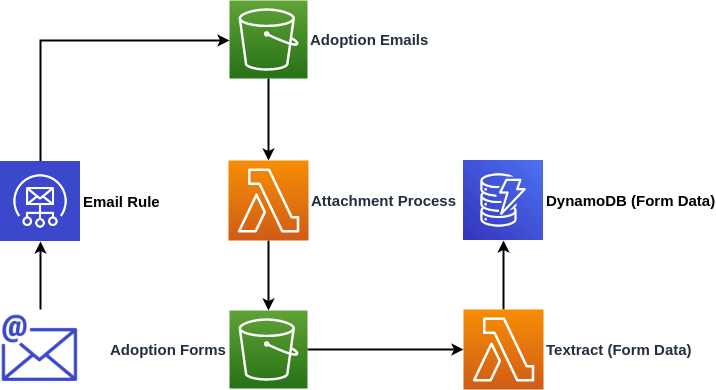

# Textract Adoption Form - WA Animals

Consuming and processing WA Animals adoption forms using AWS Textract and placing that data in DynamoDB



## Serverless Setup

```bash
## Project Setup
mkdir form-process
cd form-process

npm install -g serverless
serverless create --template aws-python3 --name form-process
```

### Requirements [Workaround]

Currently the boto3 client deployed to Lambda doesn't include textract. We'll need to force an update on the client using python requirements

```bash
serverless plugin install -n serverless-python-requirements
npm install
```

Create a `requirements.txt` file and add the following to it

```bash
boto3>=1.9.111
```

Also in the next section take careful note of the lines below

```bash
pythonRequirements:
  dockerizePip: non-linux
  noDeploy: []
```

`noDeploy` tells the `serverless-python-requirements` plugin to include boto3 and not omit it. More information can be found [HERE](https://github.com/UnitedIncome/serverless-python-requirements#omitting-packages)

## Running

```bash
# Install dependencies
cd form-process
npm install

# Install serverless (if you haven't already)
npm install -g serverless

# Deploy
serverless deploy
```

## Testing (Textract)

To test just the Textract portion of the app, run the following to copy it to your S3 bucket.

```bash
aws s3 cp ../docs/adoption-agreement.png s3://waanimalsadoptionforms
```

## Attribution

* [AWS CloudFormation Resource Reference](https://serverless.com/framework/docs/providers/aws/guide/resources/#aws-cloudformation-resource-reference)
